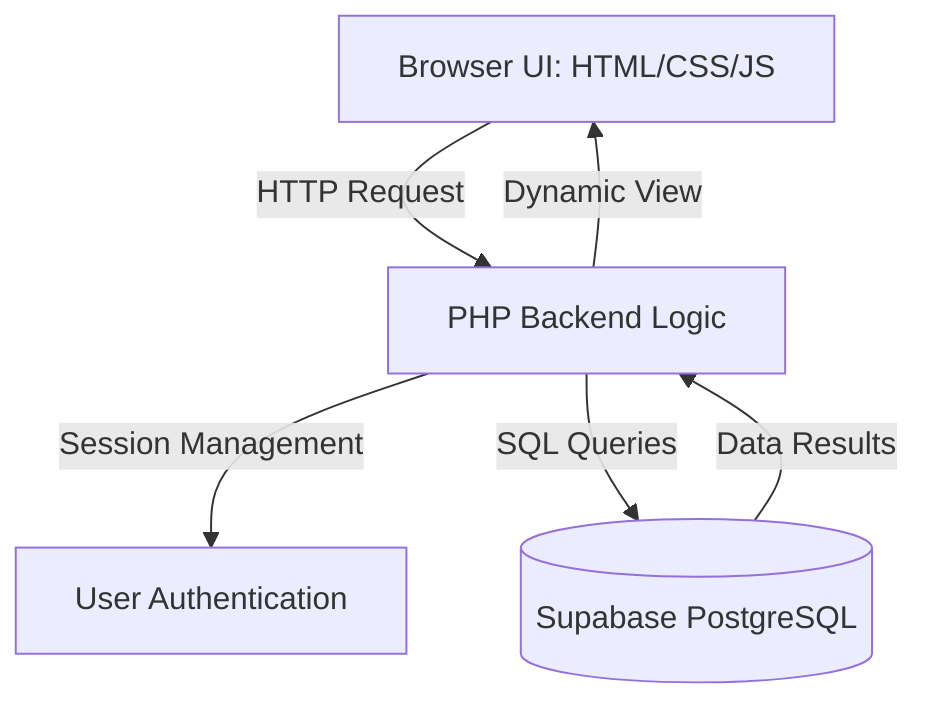
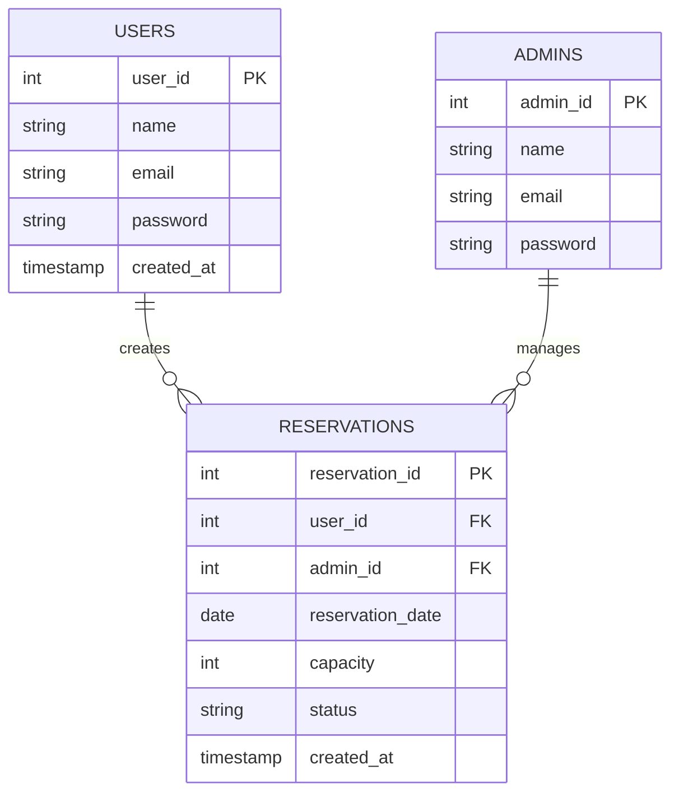
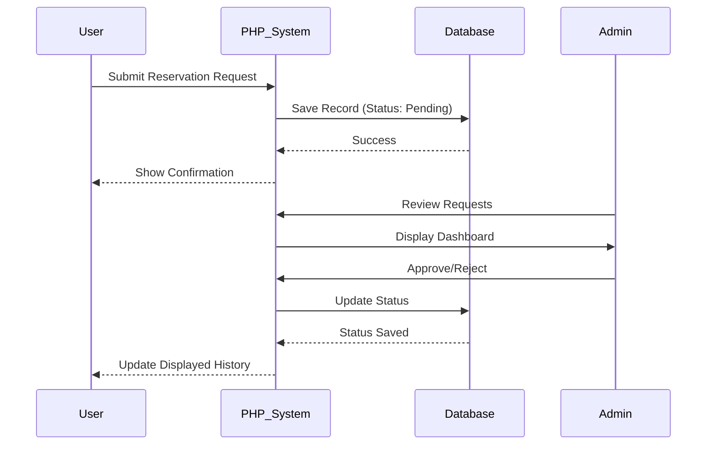

# 🌿 WildSpace
### Smart Study Space Reservation & Management System

<p align="center">
  
  
  
  
  
</p>

---

## 🚀 Overview
WildSpace is a robust PHP-based study space reservation system designed to simplify the booking and management of campus study areas. It allows students to reserve spaces online through an intuitive interface, while providing administrators with a powerful dashboard to manage approvals and oversee scheduling.

---

## 👥 Project Proponents
<p align="center">
  
</p>

<p align="center">
  <b>Ycia Debby Hebraica Magnanao</b><br>
  <i>Full-Stack Developer</i>
  <br><br>
  <b>Gerald Benedict S. Ares</b><br>
  <i>Full-Stack Developer</i>
</p>

---

## 🧩 System Architecture
The system follows a layered architecture to ensure clean data flow between the user interface and the cloud database.



---

## 🧠 Database Design (ERD)
The database is built on PostgreSQL (via Supabase) with the following relational structure:



---

## 🔄 System Workflow


---

## 🛠️ Step-by-Step Setup Tutorial

Follow these steps to get the project running on your local machine.

### 1. Prerequisites
*   **XAMPP** (Apache module).
*   **Supabase Account** (PostgreSQL hosting).
*   Your project folder named `WildSpace`.

### 2. Move Project to Local Server
1.  Navigate to your XAMPP installation folder (usually `C:\xampp\htdocs`).
2.  Paste your `WildSpace` folder inside `htdocs`.
    *   *Path Example: `C:\xampp\htdocs\WildSpace\index.php`*

### 3. Database Configuration (Supabase)
1.  Log in to [Supabase](https://supabase.com/).
2.  Go to **Project Settings > Database**.
3.  Copy your **Connection Credentials** (Host, User, Password, Port).
4.  Open `WildSpace/config/db_config.php` and update the connection settings:

```php
<?php
// Configuration for Supabase/PostgreSQL
$host = "your-supabase-host.supabase.co";
$port = "5432";
$dbname = "postgres";
$user = "postgres";
$password = "your-password";

try {
    $dsn = "pgsql:host=$host;port=$port;dbname=$dbname";
    $pdo = new PDO($dsn, $user, $password, [PDO::ATTR_ERRMODE => PDO::ERRMODE_EXCEPTION]);
} catch (PDOException $e) {
    die($e->getMessage());
}
?>
```

### 4. Start the Application
1.  Open the **XAMPP Control Panel**.
2.  Click **Start** next to the **Apache** module.
3.  Open your web browser and enter: `http://localhost/WildSpace/index.php`

---

## ⚙️ Features
- 🔐 **Authentication**: Secure Login/Register using `password_hash`.
- 📅 **Reservation System**: Create, view, and track study space bookings.
- 👨‍💼 **Admin Dashboard**: Approve/Reject requests and manage user records.
- 🛡️ **Security**: Session-based access control and input validation.

---

## 📁 Project Structure
```text
WildSpace/
├── actions/        # PHP logic scripts (login, registration, etc.)
├── admin/          # Admin-only interfaces & dashboards
├── user/           # Student-only interfaces & history
├── config/         # Database connection & settings
├── includes/       # Reusable components (Navbar, Footer)
├── assets/         # Frontend static files (CSS, Images, JS)
├── index.php       # Landing Page
└── README.md       # Project Documentation
```

---

## 🎓 Academic Context
**Subject:** CSIT226 – Information Management 1  
**Project Type:** Final Course Project (Web-based Information System)  
**Description:** This system demonstrates the practical application of relational database management, CRUD operations, and secure user authentication in a web environment.

---

## 🛡️ Security Features
- **Bcrypt Hashing:** Ensures passwords are never stored in plain text.
- **Session Validation:** Prevents unauthorized URL access to protected pages.
- **SQL Sanitization:** Uses prepared statements to prevent SQL Injection.

---

## 📜 License
For academic and educational purposes only.
